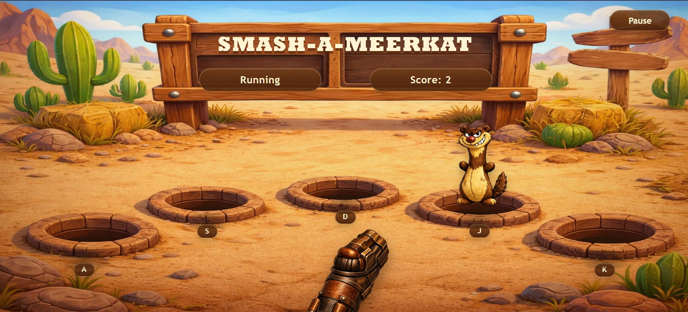

# Smash A Meerkat

Smash A Meerkat ist ein kleines Reaktionsspiel, das als Gruppenprojekt im Java-Unterricht entstanden ist.

Auf dem Spielfeld erscheinen Erdmännchen an fünf verschiedenen Positionen. Jede Position ist einer Taste auf der Tastatur zugeordnet.



## Spiel

Die fünf Positionen werden mit den Tasten `A`, `S`, `D`, `J` und `K` getroffen.

Ein getroffenes Erdmännchen erhöht den Punktestand.

Neben den normalen Erdmännchen kann auch ein Impostor erscheinen. Wird dieser getroffen, endet das Spiel.

Ein Schuss auf ein leeres Feld zieht einen Punkt ab.

Das Spiel kann gestartet, pausiert und neu gestartet werden.

## Umsetzung

Der Spielzustand wird im Spring-Boot-Backend verwaltet.

Die Eingaben aus dem Browser werden über eine WebSocket-Verbindung an den Server gesendet. Der Server verarbeitet die Eingabe und überträgt danach den aktuellen Spielzustand wieder an die verbundenen Browser.

Aktuell verwenden alle verbundenen Clients denselben Spielzustand. Es gibt keine getrennte Spielrunde pro Spieler.

## Technik

- Java 17
- Spring Boot
- Spring MVC
- Thymeleaf
- Spring WebSocket
- Jackson
- Maven

## Lokal starten

Java 17 wird benötigt.

Linux / macOS:

```bash
./mvnw spring-boot:run
```

Windows:

```bat
mvnw.cmd spring-boot:run
```

Danach:

```text
http://localhost:8080
```

## Tests

```bash
./mvnw test
```
